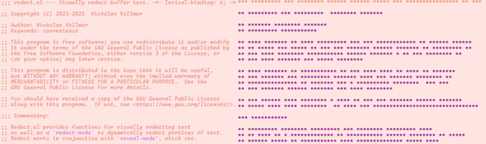
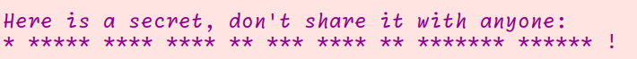
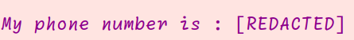
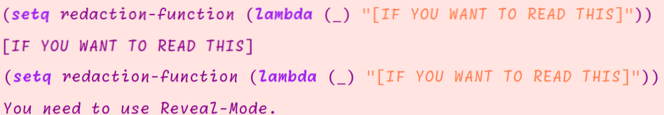

# Redact : Visual redaction elisp tools 

## Installation

### Use-package declaration

```elisp
(use-package wordel
  ;; Via Elpaca:
  :elpaca   (redact :host github :repo "progfolio/redact")
  ;; Via straight.el:
  :straight (redact :host github :repo "progfolio/redact"))
```

### Manually
Clone this repo into your load-path and, require it in your init file.
```elisp
(require 'redact)
```

## Usage

### Basic usage
You can call `M-x redact-mode` to redact a whole buffer as well as anything you type in it from then on :



To make the buffer clear again, call `M-x redact-mode` again.

You may also want to only hide a region, use `M-x redact-region` :



To make the text clear again, call `M-x redact-unredact-region`.

### Customization

You can change the character used by changing `redact-replacement`.
Here is an example with `redact-replacement` changed to `0`:


You can also use a function that returns a string instead of using a character to redact text.
With `redaction-function` set to `(lambda (_) "[REDACTED]")` we get the following :



### Reveal-mode Integration

Redact symbioses with Reveal-mode.

Simply hover over redacted text to show its true content.


